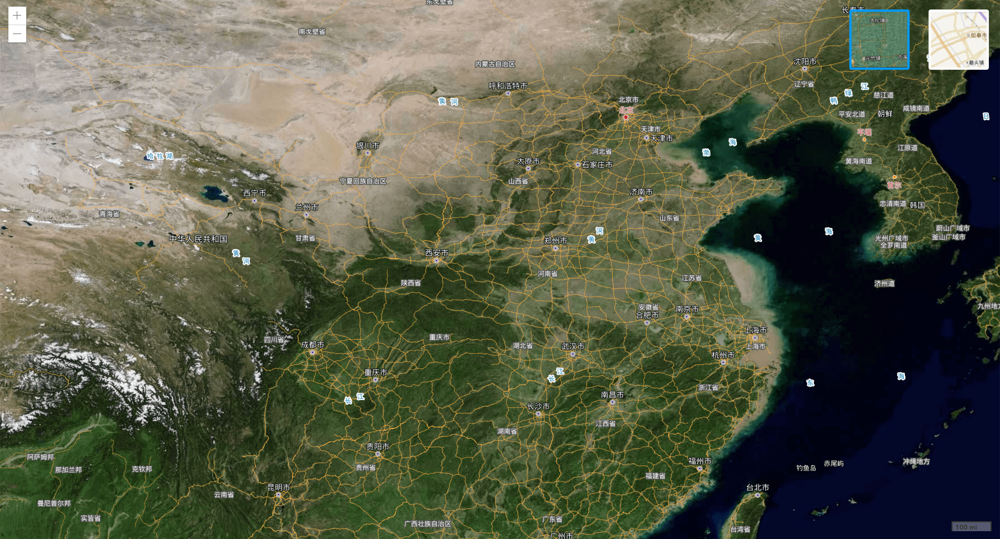

# arcgis-vue



### 官方文档

首先请确保熟悉一下两篇文档：

- esri-loader 官方仓库的地址点击 [这里](https://github.com/Esri/esri-loader)。

- Aricgis api for js 再 vue 中的使用请点击 [这里](https://developers.arcgis.com/javascript/latest/guide/vue/)。
- 这里准备了一些之前的 [笔记](./note.md)

### 使用步骤:

1. 安装依赖:
   ```
   npm install
   ```
2. 启动服务:
   ```
   npm run serve
   ```
3. 查看:

- localhost:8080/ 查看地图效果
